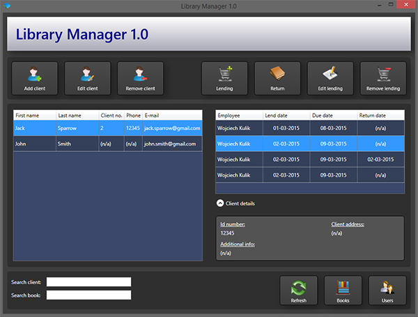

# Library Manager

It is an application to manage library (public or at home).

## Screenshots
  

## Requirements
You need to install [MS SQL Server](http://www.microsoft.com/en-us/download/details.aspx?id=29062) to launch this application.  

**Default database settings:**
- Server: .\SQLExpress
- Name: any (if it doesn't exist, will be created)
- By default MS SQL Server uses Windows Authentication, so you don't have to enter credentials  

**Credentials:**  
If you try to log in for the first time using a new database, then your entered credentials will be used to create a new account.

## Features:
- Books database
- Lending history
- Users/clients database
- Search client/book
- Logging (support for multiple accounts with roles: administrator, employee)

## To do:
- Delays list
- Settings
- Statistics