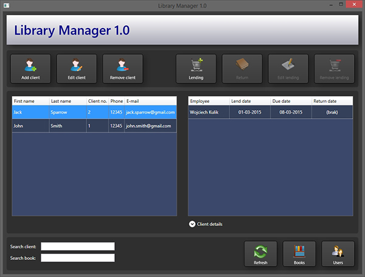

# Library Manager

It is an application to manage library (public or at home).

## Screenshots
  

## Features:
- Books database
- Lending history
- Users/clients database
- Search client/book
- Logging (support for multiple accounts with roles: administrator, employee)

## To do:
- Delays list
- Settings
- Statistics

## Remarks

**I'm still working on this application, so for now it doesn't work.**